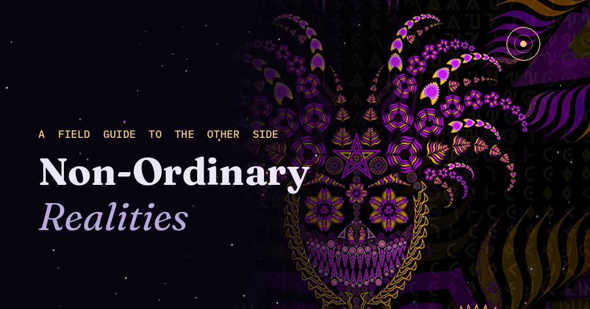

# Non-Ordinary Realities

A sourced field guide to everything that lies beyond ordinary, everyday waking consciousness. Twenty sections trace the same question — what's actually on the other side of perception? — through anthropology, psychology, neuroscience, physics, cognitive science, clinical research, theology, philosophy, mythology, and the Western esoteric tradition.

Start with **Carlos Castaneda's Nagual** and the shamanic journey between the Lower, Middle, and Upper Worlds. Meet **William James**'s "filmiest of screens" and **Stanislav Grof's holotropic states**. Cross into **Donald Hoffman's interface theory** and **Anil Seth's controlled hallucination**, then into **Deism and the clockwork god** — including the real, stranger story of Isaac Newton's secret heresy, alchemy, and lifelong argument against the very universe he's now blamed for inventing — before physicist **Carlo Rovelli's relational quantum mechanics** complicates the clock from the inside. A dedicated section asks who actually crosses into non-ordinary states and why, covering apophenia, dopamine, schizotypy, and the McGill sensory-deprivation experiments. Sit for a while with **Kant's Noumenon** and **Schopenhauer's Will**. Meet the entities — shamanic guides, Jungian archetypes, DMT's "machine elves" — and the clinical edge of **near-death experience and terminal lucidity**. Climb the roots of **Yggdrasil**, the Norse world tree, and see the same three-tiered cosmology show up nearly a thousand years earlier on the other side of the world. Land, finally, in the **Western esoteric tradition** — Sufi mysticism, Hermeticism, Kabbalah — and a closing detour into the strange modern echo of all this hiding inside a terminal window.

Every claim is sourced. Every section cites the people who made it — Eliade, Grof, Carhart-Harris, Hoffman, Rovelli, Kant, Schopenhauer, Snorri Sturluson — rather than asserting anything as given.

## Design

The site is built around a single idea: it should visually perform the split it's describing. Sections alternate between two registers — a void-dark "ink" tone and a lighter nebula "vellum" tone — so that scrolling from one section to the next is a small, literal crossing between registers of reality. A canvas starfield runs underneath the entire page, a recolored engraving of Yggdrasil anchors the world-tree section, and a recolored entity illustration greets visitors in the hero — all pulled into the same cosmic purple-gold-magenta palette.

## Image credits

- Hero artwork and favicon: adapted and recolored from ["Machine Elf / DMT Jester"](https://commons.wikimedia.org/wiki/File:DMT_Jester.jpg) by Pavel Souviron, used under [CC BY-SA 4.0](https://creativecommons.org/licenses/by-sa/4.0/). This derivative remains licensed CC BY-SA 4.0 and is **not** covered by the MIT license below.
- Yggdrasil illustration: recolored from a public-domain 19th-century engraving.

## Stack

Static HTML/CSS/JS. No build step, no framework, no dependencies. A Google tag is wired in with Consent Mode v2, so analytics stays off until a visitor actively accepts the cookie banner.

## License

MIT — see `LICENSE`.
